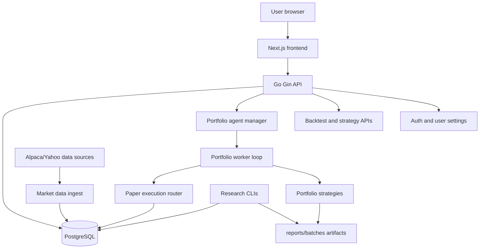
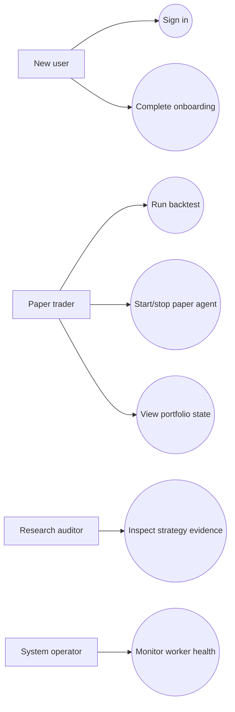
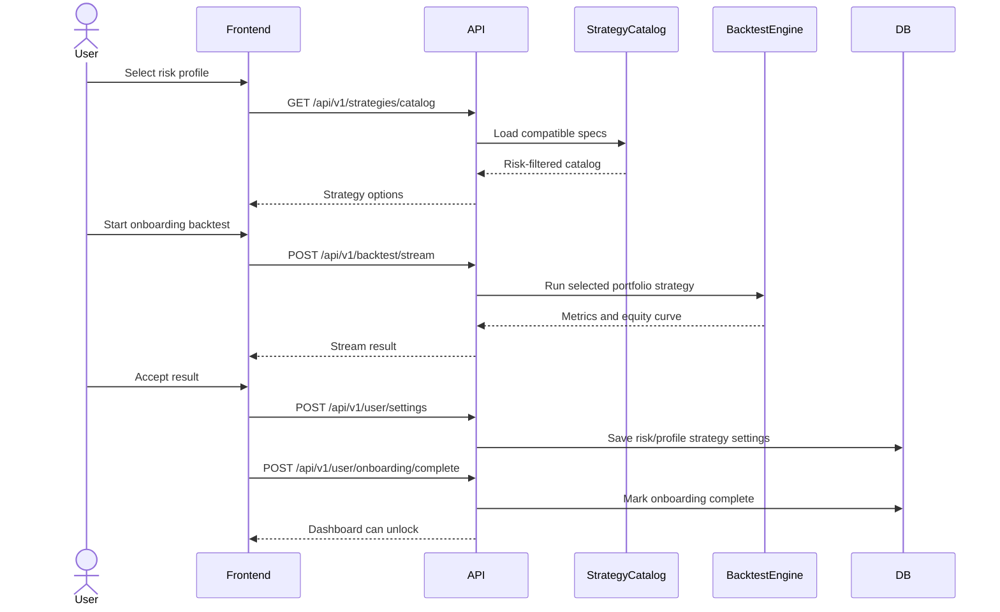
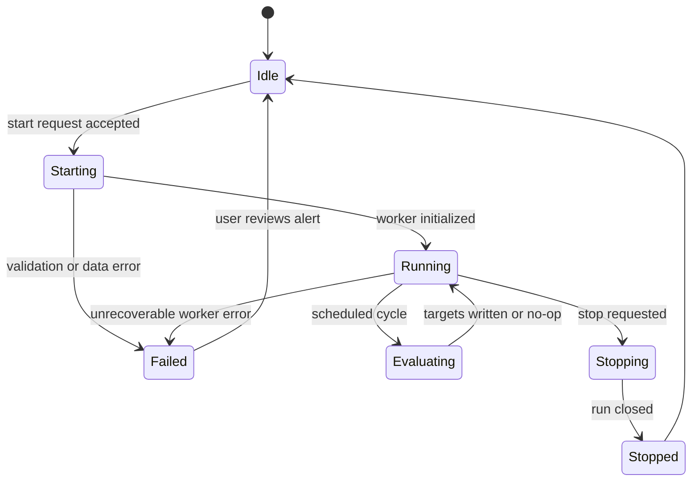
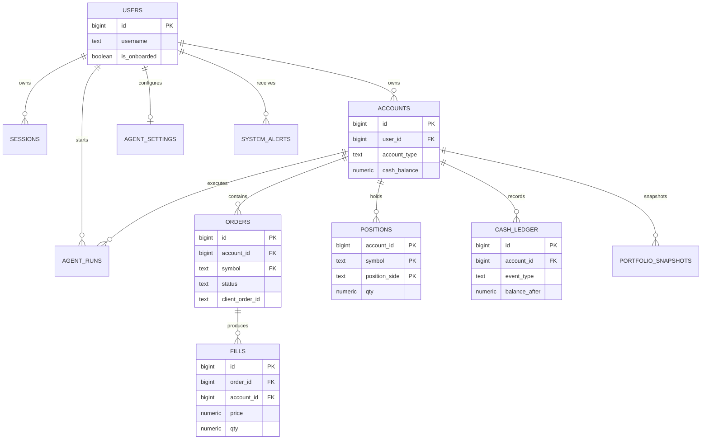
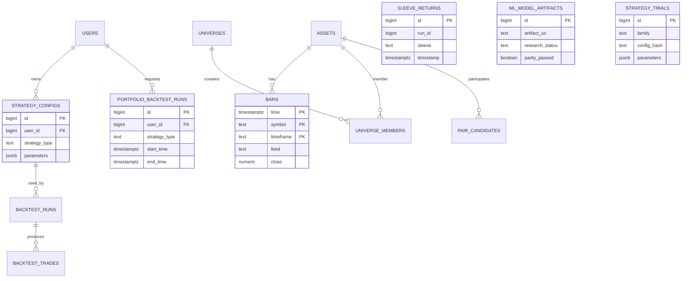

# O(Alpha) - Quant In Your Pocket

O(Alpha) is a paper-trading and quantitative research platform that helps users test portfolio strategies before any real-money execution is considered. The project combines a Go backend, a Next.js dashboard, a PostgreSQL market-data store, and a validation harness that forces each strategy to pass repeatable research checks before it can appear as a selectable paper strategy.

This README is the Orbital project writeup. It is intentionally different from the root developer README: it explains the product purpose, user value, feature design, software engineering decisions, testing evidence, and remaining work in a format suitable for evaluation.

Important scope note: O(Alpha) is research and paper trading only. It does not place live brokerage orders.

## Table of Contents

- [Overview](#overview)
- [Proposed Level of Achievement](#proposed-level-of-achievement)
- [Motivation](#motivation)
- [Vision](#vision)
- [User Stories](#user-stories)
- [Feature Groups](#feature-groups)
- [Final Phase Plan](#final-phase-plan)
- [System Architecture](#system-architecture)
- [Software Engineering Principles and Tradeoffs](#software-engineering-principles-and-tradeoffs)
- [Database Design](#database-design)
- [Testing and Quality Assurance](#testing-and-quality-assurance)
- [Strategy Evidence](#strategy-evidence)
- [Tech Stack](#tech-stack)
- [Project Structure](#project-structure)
- [Getting Started](#getting-started)
- [Project Log and Proof of Work](#project-log-and-proof-of-work)
- [Known Gaps](#known-gaps)
- [Appendix A: API Surface](#appendix-a-api-surface)
- [Appendix B: Detailed Feature Mapping](#appendix-b-detailed-feature-mapping)
- [Appendix C: Quant Research Guardrails](#appendix-c-quant-research-guardrails)

## Overview

O(Alpha) gives users a controlled workspace for building confidence in automated trading ideas. A user can create an account, choose a risk profile, run a backtest during onboarding, start a paper-trading portfolio agent, and inspect portfolio state through the dashboard.

The central engineering idea is simple: the system should not treat a good-looking backtest as proof. Strategy results are produced by a reusable validation harness, written to committed report artifacts, checked against benchmark performance, and filtered through a promotion gate that considers DSR, PBO, out-of-sample trades, costs, drawdown, and data-quality constraints.

The current deployed/demo surfaces are:

- Frontend demo: `https://o-alpha-tan.vercel.app/`
- Backend API: `https://o-alpha.onrender.com/`
- Repository root developer guide: `README.md`
- Research evidence: `reports/batches/`

## Proposed Level of Achievement

Target level: Apollo.

The project is aiming for Apollo because it goes beyond a CRUD dashboard. The backend includes a portfolio backtest engine, strategy catalog, paper execution router, persisted account state, market-data ingestion paths, agent lifecycle management, and a research harness with statistical validation gates. The frontend exposes this through an onboarding flow, portfolio dashboard, activity log, settings page, and backtest surface.

## Motivation

Retail trading tools often make strategy execution feel easy while hiding the hard question: is the strategy actually reliable? Beginner users may be attracted to automated trading but lack the process knowledge to separate a validated strategy from an overfit chart. More experienced users may understand the risks but still need a repeatable way to test, monitor, and compare strategy behavior.

O(Alpha) addresses this by combining three ideas:

- A guided user flow that starts with risk profile and paper-only onboarding, not live trading.
- A research workflow that treats validation reports as the source of truth.
- A dashboard that turns backend state into visible portfolio, execution, and alert information.

The project is therefore not only about quant finance. The software engineering challenge is to make a risky domain safer through clear system boundaries, fail-closed validation, database-backed auditability, and repeatable testing.

## Vision

The immediate goal is a trusted paper-trading environment where users can understand what a strategy is doing before any real deployment decision. The longer-term vision is a research-to-paper pipeline:

1. Researchers add or tune strategy candidates.
2. The validation harness runs walk-forward tests, cost stress, and overfitting checks.
3. Only gate-passing candidates appear as selectable catalog strategies.
4. Paper agents execute target weights through a controlled accounting model.
5. Users inspect all outcomes through dashboard telemetry and report evidence.

Live trading is deliberately out of scope for this Orbital submission. If live execution is ever added, it should require a separate approval, shortability/liquidity checks, kill-switch controls, broker permissions, and stronger end-to-end test coverage.

## User Stories

| User role | Story | Feature group | Acceptance criteria |
|---|---|---|---|
| New user | As a new user, I want to sign in quickly and complete guided onboarding so that I can use the dashboard without learning every backend setting first. | Access and onboarding | User can authenticate, select a risk profile, run/inspect an onboarding backtest, and cannot unlock the app until the backtest is accepted. |
| Beginner paper trader | As a beginner paper trader, I want the system to recommend a strategy that matches my risk profile so that I do not accidentally start an aggressive strategy. | Access and onboarding | Strategy choices are filtered by risk bucket, and saved settings must match the accepted catalog strategy. |
| Strategy tester | As a strategy tester, I want backtests to use the same engine and data rules every time so that I can compare strategies fairly. | Strategy research and backtesting | Backtests run through backend APIs/CLI paths, report net metrics, and reject invalid or unsupported requests. |
| Research auditor | As a research auditor, I want every strategy metric to point to a report artifact so that I can verify the result instead of trusting a hand-written number. | Strategy research and backtesting | README metric claims cite committed `reports/batches/...` files with line references. |
| Portfolio user | As a portfolio user, I want a single button to start or stop my paper agent so that the system manages the execution loop without manual order entry. | Paper-trading execution loop | Agent start validates risk/profile strategy alignment, creates an agent run, evaluates bars, writes paper fills, and stops cleanly. |
| Risk-aware user | As a risk-aware user, I want the dashboard to show value, allocation, positions, alerts, and trades so that I can see what the agent changed and why. | Portfolio dashboard and observability | Dashboard pages read backend portfolio state rather than static mock results for the app flow. |
| System operator | As a system operator, I want one active portfolio agent per user so that concurrent runs cannot fight over the same account state. | Agent configuration, lifecycle safety, and auditability | Start requests are guarded, active runs are listed, and stop/resume paths update run state predictably. |
| Evaluator | As an evaluator, I want the README to separate product behavior, software engineering choices, and quant details so that I can assess the project without decoding implementation jargon. | Documentation and evaluation | Main body uses plain language; equations, raw endpoint lists, and long test tables are moved to appendices. |

## Feature Groups

### 1. Access and Onboarding

Users begin with authentication and a guided setup flow. The key design decision is to keep signup simple while still requiring risk configuration before a paper agent can run. During onboarding, the user selects a risk profile, reviews compatible catalog strategies, runs a five-year style backtest, and accepts the result before the dashboard unlocks.

Implementation philosophy:

- The product separates login from trading permission. Signing in does not mean the user is ready to launch an agent.
- Risk profile is collected before any agent run because it controls strategy filtering, exposure limits, stop-loss settings, and dashboard defaults.
- The onboarding backtest acts as an explicit user acknowledgement step rather than a hidden backend default.

Key limitation:

- The current flow is still demo-oriented. The final submission should show clearer copy explaining that all trading is paper-only and that the backtest is educational evidence, not investment advice.

### 2. Strategy Research and Backtesting

O(Alpha) has two backtest surfaces: a user-facing backtest endpoint and a research-facing validation harness. The user-facing surface is for exploration and onboarding. The research harness is the authority for promotion claims.

Implementation philosophy:

- Strategy evaluation is centralized in backend code instead of duplicated in the frontend.
- Research runs write JSON and Markdown artifacts under `reports/batches/`.
- A result is treated as real only when it can be traced to an artifact produced by the harness.
- The promotion gate fails closed when PBO cannot be estimated or when data-quality/no-lookahead checks fail.

Key limitation:

- Some current research artifacts use a Yahoo100 panel that is explicitly paper-only because it is not deployment-grade point-in-time data. The README must not present those results as live-trading evidence.

### 3. Paper-Trading Execution Loop

The portfolio agent turns target weights from a catalog strategy into simulated fills and persisted account state. It is designed as a paper execution loop, not a live broker router.

Implementation philosophy:

- The worker evaluates daily bars, computes target allocations, reconciles desired positions against current holdings, and writes orders/fills/ledger/snapshots.
- The DB-backed execution router gives the dashboard a durable audit trail rather than a temporary in-memory result.
- Idempotent order/fill identifiers reduce the risk of duplicate simulated execution when a worker resumes or retries.

Key limitation:

- Paper execution proves lifecycle and accounting behavior, but it does not prove broker readiness. Live order placement remains out of scope.

### 4. Portfolio Dashboard and Observability

The dashboard is the user's control room. It shows portfolio value, positions, allocation, execution activity, alerts, strategy controls, and agent state.

Implementation philosophy:

- The frontend uses typed API helpers and shared UI components to reduce repeated request/formatting logic.
- The dashboard reads persisted backend portfolio state so the user can inspect what the paper agent actually wrote.
- Activity logs and system alerts make agent behavior visible after the fact.

Key limitation:

- The final phase should add stronger empty/error states and screenshots showing accepted flows for novices. This directly addresses evaluator concerns about utility and documentation.

### 5. Agent Configuration, Lifecycle Safety, and Auditability

The agent settings page lets users inspect or edit risk parameters, but configuration must be lifecycle-aware. A running agent should not silently change behavior in the background.

Implementation philosophy:

- The backend enforces one active portfolio agent per user.
- Runtime settings map saved risk controls into exposure caps, cadence checks, stop-loss/take-profit rules, and target suppression.
- The worker stores run metadata so resume behavior can recover the last rebalance state.

Key limitation and final-phase fix:

- Peer feedback found that advanced settings can currently be toggled while an agent is running without a strong warning. The final phase should add a visible running-agent guard in the UI and preserve the backend rejection path for unsafe changes.

## Final Phase Plan

The final phase should be described as feature bundles with sub-features. This avoids making small UI or backend tasks look like unrelated standalone features.

| Feature bundle | User role | Desired outcome | Benefit | Sub-features and acceptance criteria |
|---|---|---|---|---|
| Safer agent control | Portfolio user, risk manager | Users can start, stop, and configure paper agents without accidental unsafe changes. | Prevents confusing state changes while an agent is running. | Add running-agent warning in settings; disable or confirm unsafe edits; show active run status; backend continues to reject inconsistent profile/strategy changes. |
| Evidence-aware strategy catalog | Beginner user, research auditor | Users can see which strategies are paper-only, promoted, rejected, or research-only. | Reduces overclaiming and makes strategy trust explainable. | Strategy cards show status, benchmark, report path, and whether model artifacts are required; no unsupported strategy appears as live-ready. |
| Portfolio observability upgrade | Portfolio user | Users can understand what changed in their paper account after each agent cycle. | Improves memorability and trust. | Add clearer trade/alert explanations, empty states, latest snapshot timestamp, and CSV export guidance. |
| System and integration testing | Evaluator, maintainer | The team can prove the app works across API, database, worker, and frontend boundaries. | Addresses the current testing gap. | Add integration tests for onboarding-to-agent start, paper fill persistence, stop/resume, and settings guard; add at least one automated UI smoke test for login/demo dashboard flow. |
| Documentation and proof pack | Evaluator | The submission makes engineering work easy to inspect. | Reduces reviewer confusion and demonstrates process. | Include corrected diagrams, GitHub Actions screenshots, PR/commit screenshots, project log screenshot, and representative test output in `docs/submission/assets/`. |

## System Architecture

The diagram below is a system architecture diagram, not UML. It explains deployment and responsibility boundaries.



Layer responsibilities:

| Layer | Main responsibility | Examples |
|---|---|---|
| Presentation | Render user workflows and dashboard state. | Next.js pages, app shell, charts, strategy selector. |
| API and orchestration | Validate requests, enforce auth, expose backtest/agent/portfolio endpoints. | Gin handlers, middleware, router. |
| Domain logic | Compute signals, run backtests, apply risk controls, manage portfolio targets. | Backtest engine, strategy catalog, HMM/risk overlay, portfolio worker. |
| Persistence | Preserve user, account, order, fill, ledger, bars, and research state. | PostgreSQL migrations and repositories. |
| Evidence | Store validation outputs and parity artifacts. | `reports/batches/...` JSON, Markdown, CSV reports. |

### UML Use-Case View



### User Flow

This replaces the earlier flowchart that lacked explicit start/end nodes.

```mermaid
flowchart TD
    Start([Start: visitor opens O(Alpha)]) --> PublicPages[Browse public pages]
    PublicPages --> Login{Authenticated?}
    Login -- No --> LoginModal[Login or demo login]
    LoginModal --> Onboarded{Onboarding complete?}
    Login -- Yes --> Onboarded
    Onboarded -- No --> RiskProfile[Choose risk profile]
    RiskProfile --> Catalog[Select compatible catalog strategy]
    Catalog --> Backtest[Run onboarding backtest]
    Backtest --> Accepted{Backtest accepted?}
    Accepted -- No --> Catalog
    Accepted -- Yes --> Dashboard[Dashboard unlocked]
    Onboarded -- Yes --> Dashboard
    Dashboard --> StartAgent[Start paper agent]
    StartAgent --> Monitor[Monitor portfolio, trades, alerts]
    Monitor --> Settings[Review settings]
    Settings --> Running{Agent running?}
    Running -- Yes --> Guard[Warn or block unsafe edits]
    Running -- No --> SaveSettings[Save settings]
    Guard --> Monitor
    SaveSettings --> Monitor
    Monitor --> StopAgent[Stop paper agent]
    StopAgent --> End([End: signed out or inactive])
```

### Key Sequence: Onboarding Backtest to Dashboard Unlock



### Agent Lifecycle State View



## Software Engineering Principles and Tradeoffs

| Principle | How O(Alpha) applies it | Tradeoff |
|---|---|---|
| Separation of concerns | Frontend renders workflows; API validates requests; domain packages run strategies; repositories persist state; research CLIs write validation artifacts. | More files and interfaces, but easier to test and reason about each boundary. |
| Fail-closed safety | Missing model artifacts, unestimated PBO, invalid risk/profile combinations, and unsafe strategy requests are rejected rather than guessed. | Some demo flows may feel strict, but the system avoids silently presenting unreliable results. |
| Data integrity by construction | Foreign keys, unique constraints, check constraints, and append-only ledger records make invalid states harder to write. | Schema design is more detailed, but fewer correctness rules live only in application memory. |
| Concurrency and lifecycle control | One active portfolio agent per user and explicit run states prevent multiple workers from controlling the same paper account. | Users may need to stop a running agent before changing some settings. |
| Evidence-driven validation | Strategy claims cite harness-generated artifacts under `reports/batches/`. | The README cannot use impressive numbers unless the artifact trail supports them. |
| Maintainability through local patterns | Go tests cover backtest, validation, API parsing, agent runtime settings, market data parsing, ML feature parity, and strategy factories. | More up-front test writing, but safer iteration in a high-risk domain. |

### Why "first-class lifecycle safety" matters

In plain language: a paper agent is a background process that can keep acting after the user leaves the page. If settings change while it is running, the worker and dashboard can disagree about which risk profile or strategy is active. O(Alpha) therefore treats start, stop, resume, settings edits, and failure states as product behavior, not as implementation details.

## Database Design

The database is designed around normalization, auditability, and tenant isolation. The earlier README described too many tables one by one; this section explains why the core tables exist.

### Normalization Rationale

- `users` stores identity-level data. It does not store portfolio balances or strategy runs, because those facts change at different rates and have different constraints.
- `accounts` stores paper account ownership and cash state. Separating accounts from users allows a user to own more than one account type or provider account later without duplicating identity fields.
- `orders` stores intended paper actions; `fills` stores executions against orders. Keeping them separate preserves partially filled/rejected order states and avoids mixing intent with execution.
- `positions` stores current holdings by account, symbol, and side. It is derived from fills but persisted for efficient dashboard reads.
- `cash_ledger` is append-only. Cash movement history is never overwritten, which supports audit and reconstruction.
- `strategy_configs` stores reusable strategy definitions. Backtest and agent runs can reference a configuration without copying all strategy metadata into every run row.
- `bars` stores market candles keyed by symbol, timeframe, and dataset identity. Market data is separated from strategies so the same bars can be reused across backtests, workers, and validation.
- `portfolio_backtest_runs`, `sleeve_returns`, `ml_model_artifacts`, `pair_candidates`, and `strategy_trials` store research outputs separately from user portfolio state.

This structure is close to 3NF because each table describes one type of fact, non-key fields depend on the key for that table, and repeated groups such as fills, alerts, and snapshots are not embedded into user or account rows. BCNF-style thinking appears in the composite account ownership constraints: account-scoped trading records carry `(account_id, user_id)` relationships so account ownership is enforced by the database rather than by caller discipline alone.

### ER View: User, Account, and Paper Execution



### ER View: Research, Strategies, and Market Data



## Testing and Quality Assurance

The original README overemphasized a long unit-test table. The refreshed view is a test pyramid: what is tested today, what evidence exists, and what still needs integration/system coverage.

### Latest Local Verification

These commands were run during this README refresh on 2026-07-05:

```bash
cd /Users/shizhen/Documents/O-Alpha/backend
go test ./...
```

Result: passed.

```bash
cd /Users/shizhen/Documents/O-Alpha/frontend
npm run typecheck
```

Result: passed.

### Test Matrix

| Level | Current evidence | Representative checks | Status |
|---|---|---|---|
| Static frontend checks | `frontend/package.json` exposes `typecheck`, `format:check`, and lint/build scripts. | TypeScript compile check with `tsc --noEmit`. | Present. |
| Backend unit tests | 54 Go `_test.go` files across API, backtest, validation, agent, market data, ML, and strategy packages. | Signal idempotency, no-lookahead tests, PBO/DSR promotion tests, risk overlay tests, paper account concurrency tests. | Present. |
| Research validation tests | `internal/research/alphavalidation` and `internal/backtest/validation` tests. | Promotion fails closed when PBO is unavailable; candidate report includes PBO diagnostics; cost stress is visible. | Present. |
| Parity and ML checks | Feature/leaves parity commands and committed parity artifacts. | Python/Go feature consistency and model artifact behavior. | Present for selected paths. |
| CI/CD | `.github/workflows/ci-cd.yml`, `market-data-ingest.yml`, `portfolio-agent-worker.yml`. | Frontend quality/build gate; scheduled ingest; scheduled portfolio worker resume. | Present, but backend Go tests should be added to CI. |
| Integration tests | API + DB + worker tests across full user journey. | Onboarding -> strategy catalog -> agent start -> fill persistence -> dashboard read. | Planned. |
| System/UI tests | Automated browser smoke tests for deployed or local app. | Login/demo flow, onboarding acceptance, dashboard navigation, settings guard warning. | Planned. |
| User testing | Novice/evaluator walkthroughs. | Time-to-first-backtest, ability to find report evidence, ability to stop agent. | Planned. |

### Quant-Specific Testing Strategy

Quant systems need different tests from ordinary dashboards. O(Alpha) therefore includes or plans these checks:

- Point-in-time feature tests: feature builders must use only information available at the current bar.
- No-lookahead tests: strategies should not read future bars or future labels.
- Walk-forward validation: train/test splits evaluate whether a rule survives out-of-sample periods.
- PBO estimation: parameter variants are compared to detect overfit selection.
- DSR gate: high Sharpe is not enough; the Sharpe must survive deflation for multiple trials.
- Cost stress: normal, 2x, and 3x cost scenarios are visible in validation reports.
- Benchmark comparison: candidates must improve risk-adjusted behavior against the correct benchmark.

### CI/CD Improvement Needed

The existing CI workflow is strongest on frontend quality. The final phase should add a backend CI job:

```yaml
backend-tests:
  runs-on: ubuntu-latest
  defaults:
    run:
      working-directory: ./backend
  steps:
    - uses: actions/checkout@v4
    - uses: actions/setup-go@v5
      with:
        go-version: "1.23"
        cache-dependency-path: backend/go.sum
    - run: go test ./...
```

## Strategy Evidence

Metric rule: every Sharpe, DSR, PBO, drawdown, return, trade count, or promotion claim below cites a committed artifact line. If a result cannot be traced to `reports/batches/...`, it is not included.

### Agent Catalog Summary

The catalog summary states that it was generated from official `cmd/alpha-research` artifacts only and that no metrics were hand-entered (`reports/batches/2026-06-03_alpha_validation_agent_catalog_buckets_summary/agent_catalog_bucket_comparison.md:3`). It also records the method: Yahoo-adjusted 100-symbol research panel, 1Day timeframe, 756 train bars, 252 test bars, 126 step bars, and 30 minimum OOS trades (`reports/batches/2026-06-03_alpha_validation_agent_catalog_buckets_summary/agent_catalog_bucket_comparison.md:13-15`). PBO is estimated within each risk bucket using three catalog entries as variants (`reports/batches/2026-06-03_alpha_validation_agent_catalog_buckets_summary/agent_catalog_bucket_comparison.md:16`). All catalog entries are paper-only because the Yahoo100 panel is not survivorship-aware or deployment-grade point-in-time data (`reports/batches/2026-06-03_alpha_validation_agent_catalog_buckets_summary/agent_catalog_bucket_comparison.md:17`).

| Strategy/readout | What the artifact says | Source |
|---|---|---|
| `lgbm_ranker_h63_low`, 2015 primary | Promote `true`, return `459.70%`, Sharpe `0.924`, DSR `1.000`, PBO `0.067`, trades `49`, main reason `pass`. | `reports/batches/2026-06-03_alpha_validation_agent_catalog_buckets_summary/agent_catalog_bucket_comparison.md:36` |
| `lgbm_ranker_h63_low`, 2016 shifted | Promote `true`, return `456.06%`, Sharpe `0.990`, DSR `1.000`, PBO `0.077`, trades `49`, main reason `pass`. | `reports/batches/2026-06-03_alpha_validation_agent_catalog_buckets_summary/agent_catalog_bucket_comparison.md:39` |
| `ranker_proxy_h63_low`, 2015 primary | Promote `true`, return `420.45%`, Sharpe `0.907`, DSR `1.000`, PBO `0.067`, trades `103`, main reason `pass`. | `reports/batches/2026-06-03_alpha_validation_agent_catalog_buckets_summary/agent_catalog_bucket_comparison.md:38` |
| `ranker_proxy_h63_low`, 2016 shifted | Promote `true`, return `397.15%`, Sharpe `0.953`, DSR `1.000`, PBO `0.077`, trades `94`, main reason `pass`. | `reports/batches/2026-06-03_alpha_validation_agent_catalog_buckets_summary/agent_catalog_bucket_comparison.md:41` |
| Medium-risk LGBM | Raw returns are high, but the strategy fails because PBO is above the promotion threshold in both windows. | `reports/batches/2026-06-03_alpha_validation_agent_catalog_buckets_summary/agent_catalog_bucket_comparison.md:47`, `reports/batches/2026-06-03_alpha_validation_agent_catalog_buckets_summary/agent_catalog_bucket_comparison.md:50` |
| High-risk strategies | All high-risk rows fail PBO and remain diagnostics/challengers, not promoted agent choices. | `reports/batches/2026-06-03_alpha_validation_agent_catalog_buckets_summary/agent_catalog_bucket_comparison.md:58-63`, `reports/batches/2026-06-03_alpha_validation_agent_catalog_buckets_summary/agent_catalog_bucket_comparison.md:70` |

Plain-language readout: the low-risk ranker entries are the only catalog entries shown here that pass in both tested windows. The README should not claim that the medium/high strategies are promoted just because their returns look larger.

### Research-Only Examples

| Research artifact | Evidence | Interpretation |
|---|---|---|
| Daily ranker walk-forward | The artifact labels its status `python_prescreen_only` and says official alpha promotion still requires the `cmd/alpha-research` DSR/PBO gate (`reports/batches/2026-06-03_yahoo100_daily_ranker_walkforward_slow_horizons_2018_2026/daily_ranker_walkforward.md:3-9`). | Useful prescreen evidence, not a promotion claim. |
| HMM exit research | The artifact states the benchmark return/Sharpe/max drawdown, then shows the best HMM exit variant underperformed buy-and-hold on total return while reducing drawdown (`reports/batches/2026-06-16_voo_hmm_regime_history/voo_1day_hmm_exit_research.md:18-22`). | Useful risk-overlay research, not proof of superior total return. |

## Tech Stack

| Layer | Technology | Purpose |
|---|---|---|
| Frontend | Next.js, React, TypeScript, Tailwind, SWR, Recharts | Dashboard, onboarding, charts, settings, portfolio views. |
| Backend | Go, Gin, zerolog, golang-migrate | API, backtest engine, agent manager, research CLIs. |
| Database | PostgreSQL / TimescaleDB-compatible schema | Users, accounts, bars, orders, fills, ledger, snapshots, research metadata. |
| Market data | Alpaca and Yahoo daily ingestion paths | Bar ingestion and latest marks for paper state. |
| CI/CD | GitHub Actions, Vercel, Render | Frontend quality/build checks, deployment, scheduled ingest/worker jobs. |
| Research artifacts | JSON, Markdown, CSV under `reports/batches/` | Evidence trail for validation and parity results. |

## Project Structure

```text
backend/
  cmd/                         CLI entrypoints: API, ingest, research, backtest, worker
  internal/api/                Gin router, handlers, middleware
  internal/backtest/           Single-symbol and portfolio backtest engines
  internal/backtest/validation Promotion gate, DSR/PBO, purged CV logic
  internal/agent/              Agent lifecycle, HMM/risk overlay, worker logic
  internal/alpha/              Portfolio strategy families
  internal/ml/                 Feature builders, labels, calibration, model registry
frontend/
  src/app/                     Next.js routes
  src/components/              UI and page components
  src/lib/                     API helpers, auth, CSV, utilities
migrations/                    PostgreSQL schema migrations
reports/batches/               Committed research and validation artifacts
docs/                          Research log, plan, blockers, submission writeups
docs/submission/assets/        Screenshots and proof-of-work assets for final submission
```

## Getting Started

For local development, see the root `README.md`. The short version is:

```bash
make setup-local
make migrate
make run-api
```

Then start the frontend:

```bash
cd frontend
npm install
npm run dev
```

For a full container stack:

```bash
make setup-docker
make up
```

Environment variables such as `DATABASE_URL`, `REDIS_URL`, `ALPACA_API_KEY`, `ALPACA_API_SECRET`, `NEXT_PUBLIC_API_URL`, and `OALPHA_DAILY_RANKER_ARTIFACT_ROOT` are documented in the root developer README.

## Project Log and Proof of Work

The final submission should include screenshots in `docs/submission/assets/` and link them here.

| Evidence item | Status | Asset placeholder |
|---|---|---|
| GitHub Actions frontend CI passing | Needs screenshot | `docs/submission/assets/github-actions-frontend-ci.png` |
| Backend `go test ./...` local output | Command passed on 2026-07-05 | `docs/submission/assets/backend-go-test-output.png` |
| Frontend `npm run typecheck` output | Command passed on 2026-07-05 | `docs/submission/assets/frontend-typecheck-output.png` |
| Commit/PR history showing team work | Needs screenshot | `docs/submission/assets/github-commit-history.png` |
| Project log hours | Needs screenshot/export | `docs/submission/assets/project-log-hours.png` |
| Corrected architecture/flow/ER diagrams | Markdown diagrams present; image exports optional | `docs/submission/assets/` |

## Known Gaps

| Feedback/gap | Response in this README | Final implementation action |
|---|---|---|
| README was too implementation-heavy and jargon-heavy. | Main body now explains user goals, feature groups, principles, and tradeoffs in plain language. | Keep equations and raw endpoint details in appendices. |
| Features were poorly categorized. | Features are grouped into five evaluator-friendly bundles. | Use the same grouping in poster/video. |
| Architecture diagram was mislabeled as UML. | It is now labeled System Architecture. | Add exported image if Mermaid is not accepted by submission platform. |
| User flow lacked start/end nodes. | New Mermaid user flow includes explicit start and end nodes. | Export as PNG if needed. |
| ER diagram was not a real ER diagram. | New Mermaid ER views use relationships and PK/FK fields. | Validate visual legibility before final submission. |
| Database design lacked normalization explanation. | Added 3NF/BCNF rationale. | Optionally add a short schema proof table for final review. |
| Testing looked trivial and unit-test-heavy. | Added test pyramid, quant-specific tests, current evidence, and planned integration/system tests. | Implement at least one integration and one UI smoke test before final milestone if time allows. |
| Strategy explanation lacked actual data. | Added artifact-cited strategy evidence table. | Do not add any metric without a report path and line. |
| Project management/version control needed proof. | Added proof-of-work placeholders. | Fill assets with screenshots before submission. |
| Unit tests should move to appendix/spreadsheet. | Main body summarizes; detailed tests belong outside the main narrative. | Optional: create a test inventory CSV/spreadsheet. |

## Appendix A: API Surface

This appendix lists representative endpoints without turning the main README into an API manual.

| Area | Endpoint | Purpose |
|---|---|---|
| Auth | `POST /auth/login` | Login or demo authentication path. |
| Auth | `POST /auth/validate` | Validate a token/session. |
| User | `GET /api/v1/user/settings` | Read saved risk/profile settings. |
| User | `POST /api/v1/user/settings` | Save risk/profile settings. |
| User | `POST /api/v1/user/onboarding/complete` | Mark onboarding complete after accepted backtest. |
| Strategy catalog | `GET /api/v1/strategies/catalog` | List catalog strategies and recommended risk mappings. |
| Backtest | `POST /api/v1/backtest` | Run normal backtest request. |
| Backtest | `POST /api/v1/backtest/stream` | Stream backtest progress/results for the UI. |
| Agent | `POST /api/v1/agent/portfolio/start` | Start a portfolio catalog paper agent. |
| Agent | `POST /api/v1/agent/portfolio/stop` | Stop a portfolio paper agent. |
| Agent | `GET /api/v1/agent/list` | List active or known agent runs. |
| Portfolio | `GET /api/v1/user/portfolio/summary` | Read latest dashboard summary. |
| Portfolio | `GET /api/v1/user/portfolio/positions` | Read current positions. |
| Portfolio | `GET /api/v1/user/portfolio/trades` | Read execution stream. |
| Portfolio | `GET /api/v1/user/portfolio/alerts` | Read system alerts. |

## Appendix B: Detailed Feature Mapping

| Original feature area | New grouped location | Notes |
|---|---|---|
| Login | Access and onboarding | Keep security explanation concise. |
| Onboarding | Access and onboarding | Emphasize risk profile, strategy filter, backtest acceptance gate. |
| Landing backtest | Strategy research and backtesting | Treat as user-facing exploration, not promotion proof. |
| Portfolio backtest engine | Strategy research and backtesting | Explain fair comparison, cost model, aligned panels. |
| Strategy catalog | Strategy research and backtesting; evidence-aware strategy catalog plan | Include status and evidence paths. |
| HMM regime/risk overlay | Strategy research and backtesting; agent configuration | Present as risk context, not magic prediction. |
| ML meta-label strategy | Strategy research and backtesting | State artifact and parity requirements. |
| Paper trading engine | Paper-trading execution loop | Stress simulated fills and no live trading. |
| DB-backed execution router | Paper-trading execution loop; database design | Explain idempotency and ledger. |
| Websocket/market data streaming | Portfolio dashboard and observability | Explain latest marks and ingestion paths. |
| Portfolio live state stream | Portfolio dashboard and observability | Show how dashboard reads backend state. |
| Agent list/API | Agent lifecycle safety | Use for active run inspection. |
| Agent settings | Agent lifecycle safety | Add running-agent guard in final phase. |
| Activity logs | Portfolio dashboard and observability | Treat as audit trail. |
| Enhanced database schema | Database design | Explain normalization; move table inventory out of main body. |

## Appendix C: Quant Research Guardrails

This appendix keeps the quant details available without letting them dominate the main README.

- Backtests must use the existing Go harness or CLI tools. Do not invent numbers manually.
- Reported metrics are net of the selected cost scenario when they come from validation reports.
- DSR must meet the promotion threshold.
- PBO must be estimated from variants and must pass the threshold.
- Out-of-sample trades must meet the minimum count.
- Strategy performance must be compared against the correct benchmark.
- Data-quality and no-lookahead checks must pass.
- A high in-sample Sharpe is not alpha by itself.
- Pair-trading and cointegration outputs are research-only until offline pair approval and shortability gates exist.
- Cross-sectional strategies need a sufficiently large universe to be meaningful.
