# Entity-Relationship Diagram

This diagram represents the logical PostgreSQL schema after migrations `000001` through `000004`. Physical `bars` partitions are omitted and represented by the single logical `bars` entity.

Open [`entity-relationship-diagram.mmd`](./entity-relationship-diagram.mmd) in the Mermaid Live Editor or render it with Mermaid CLI.

## Notation

- Solid relationships are identifying: the foreign key forms part of the child primary key.
- Dashed relationships are non-identifying.
- A circle means optional participation; a bar means mandatory participation.
- A crow's foot means many.

## Schema integrity corrections

- `sleeve_returns.run_id` now has an enforced foreign key to `portfolio_backtest_runs.id` with cascading deletion.
- `bars` now has a six-column primary key: `(time, symbol, timeframe, feed, adjustment, source)`.
